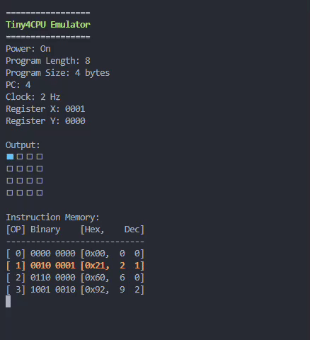

# Tiny4CPU


Tiny4CPU is a lightweight and educational 4-bit CPU emulator designed for
simplicity. This project provides a hands-on exploration into the fundamentals
of computer architecture, offering a platform to experiment with assembly
language programming in a compact environment.

Dive into the world of microprocessors with Tiny4CPU and witness the power of
4 bits in action.



Code for the upper example:

```bash
; Usage of instruction OUT

; Init Register X to 0
Init:
LDX #0

; Main Loop
Loop:
ADX #1
OUT #0
JMP Loop
```

## Features

- 4-bit architecture with its own assembler
- 16-instruction set for data manipulation and control flow
- 2 general-purpose registers and memory space of 8 bytes
- Ability to adjust CPU clock cycles for synchronization in milliseconds
- Assembly language support
- Modular and extensible design
- Comprehensive documentation
- Examples for each instruction

## How to write a program for the Tiny4CPU

Tiny4CPU programs are written in T4C Assembly and saved as `*.t4c` files.
Use the Tiny4CPU Assembler to assembly your program to a `*.bin` file.
After that, load your ROM `*.bin` file using the Tiny4CPU executable, including
the file path and the clock time in milliseconds.

The recommended clock time is 1000 milliseconds.

Example:

```bash
./assembler .../examples/output.t4c
./tiny4cpu .../examples/output.bin 1000
```

## Instruction set architecture (ISA)

### Instruction Set

Tiny4CPU has `16 opcodes` (operation code, OP or instruction machine code),
which are all `one byte long` and stored `big-endian`. Big-endian means that
the most-significant-byte is saved in memory first (i.e. the lower memory address).
Currently only 10 of potentially 16 opcodes are defined.

| Mnemonic | Instruction | Description                                       |
| -------- | ----------- | ------------------------------------------------- |
| LDX      | 0000 kkkk   | Load Register X with immediate nibble value k     |
| LDY      | 0001 kkkk   | Load Register Y with immediate nibble value k     |
| ADX      | 0010 kkkk   | Add immediate nibble value k to Register X        |
| ADY      | 0011 kkkk   | Add immediate nibble value k to Register Y        |
| SUX      | 0100 kkkk   | Subtract immediate nibble value k from Register X |
| SUY      | 0101 kkkk   | Subtract immediate nibble value k from Register Y |
| OUT      | 0110 kkkk   | Set output to nibble value from register (1)      |
| JXZ      | 0111 kkkk   | Jump to memory address k if Register X is zero    |
| JYZ      | 1000 kkkk   | Jump to memory address k if Register Y is zero    |
| JMP      | 1001 kkkk   | Unconditional jump to memory address k            |
| ---      | 1010        | Unused                                            |
| ---      | 1011        | Unused                                            |
| ---      | 1100        | Unused                                            |
| ---      | 1101        | Unused                                            |
| ---      | 1110        | Unused                                            |
| ---      | 1111        | Unused                                            |

(1) Use value #0 for Register X or value #1 for Register Y

### Registers

| Register | Size (bits) | Description                  |
| -------- | ----------- | ---------------------------- |
| PC       | 4           | Program Counter              |
| IR       | 8           | Instruction Register         |
| IAR      | 8           | Instruction Address Register |
| ACC      | 4           | Accumulator                  |
| MAR      | 4           | Memory Address Register      |
| RX       | 4           | General-purpose register X   |
| RY       | 4           | General-purpose register Y   |

### Memory

- Mono-directional 4-bit address-bus from the microprocessor unit (MPU) to memory
- The memory layout consists of one Memory Address Register (MAR).
  The MAR is connected to two 2x4 decoder, enabling addressing of up
  to 16 memory locations
- Each memory location holds 4 bits of data, resulting in a total memory size
  of 8 bytes

## References

- [ANSI Escape Code](https://en.wikipedia.org/wiki/ANSI_escape_code)
- [ANSI Escape Sequences, Github](https://gist.github.com/fnky/458719343aabd01cfb17a3a4f7296797)
- [ASCII Chart](https://en.cppreference.com/w/cpp/language/ascii)
- [DDL4-CPU, A Modular 4-Bit CPU Design by Dave](https://hackaday.io/project/158510/logs)
- [Github project td4-py by yashikota](https://github.com/yashikota/td4-py)
- [How to Build a CPU by Iku Watanabe](https://www.amazon.co.jp/CPU%E3%81%AE%E5%89%B5%E3%82%8A%E3%81%8B%E3%81%9F-%E6%B8%A1%E6%B3%A2-%E9%83%81/dp/4839909865/ref=asap_bc?ie=UTF8)
- [Symbl](https://symbl.cc/en)
- [yashikota/td4-py](https://github.com/yashikota/td4-py)
